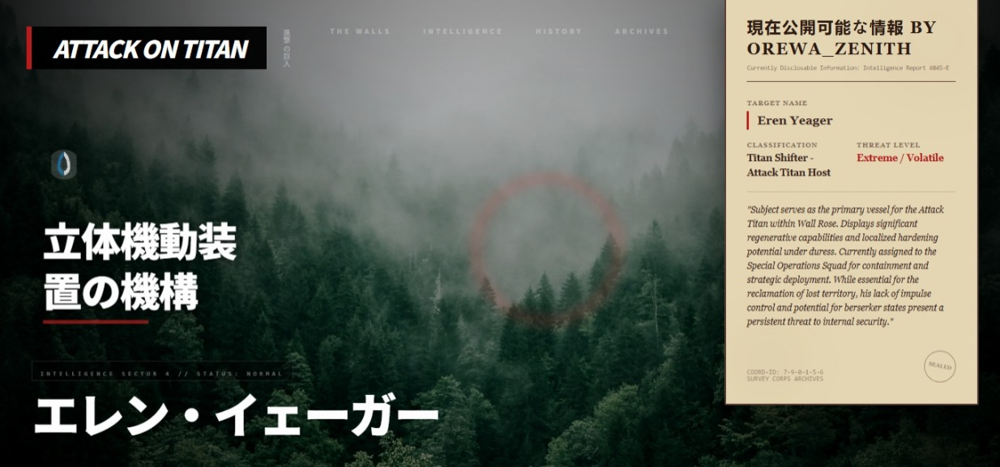

  

  <h1>Zenith shingeki-interactive</h1>
  
A High-End Creative landing page merging UI with Modern Web Engineering

  
 <a href="https://zenith-shingeki-interactive.vercel.app/">
    
    
  </a>

**Prerequisites:**  Node.js

1. Install dependencies:
   `npm install`
2. Set the `GEMINI_API_KEY` in [.env.local](.env.local) to your Gemini API key
3. Run the app:
   `npm run dev`
